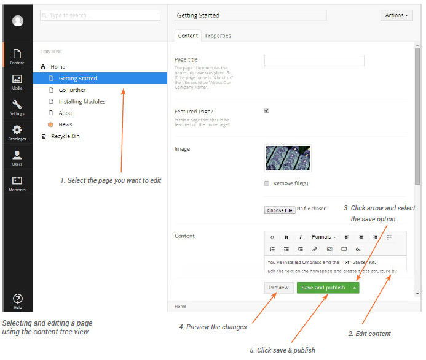
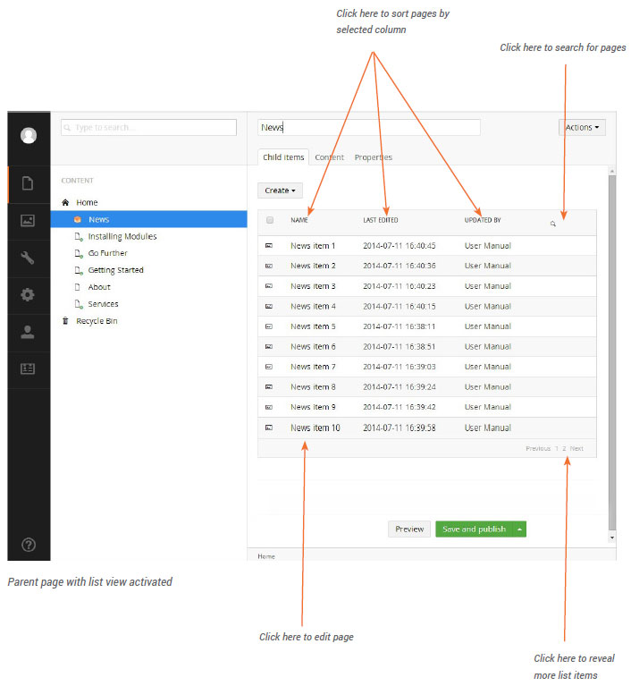

# Editing Existing Content

## Content Within the Tree View

When you want to edit content on an existing page you can follow this process:

1. Find and select the page you want to edit.
2. Edit the pages content within the content area. Each different type of page will have different content fields for you to populate such as text boxes, content and date pickers and rich text editors. See section 3 for more information on working with content.
3. Click the arrow on the ***Save and publish*** button to reveal more options. Now you can click ***Save*** in the popup menu.
4. Click the ***Preview*** button to preview how the page will look once published to the live website.
5. If you are happy with the changes you can now click ***Save and publish*** which will make the changes live.

## List View Pages

Some of the pages in your website may use a list view style which shows child pages in a table format rather than the standard tree view.

The first screenshot below shows ten child items below the **News** page in the tree view. If the website were to have tens or even hundreds more news pages, the tree view would become very large and unmanageable.

The second screenshot below shows how the list view works. You will notice there are now no child pages for the **News** section within the tree view but pages are instead listed within a table on the right hand side.

The table will show a maximum of ten child pages at any one time. Pagination controls allow you to navigate to additional pages should you have more than ten. In the top right of the table there is a search facility which enables you search for specific pages. This enables you to quickly and easily locate pages without having to use the pagination. You can click the column titles to sort the list items. For example clicking the name column title will sort the list items alphbetically.

